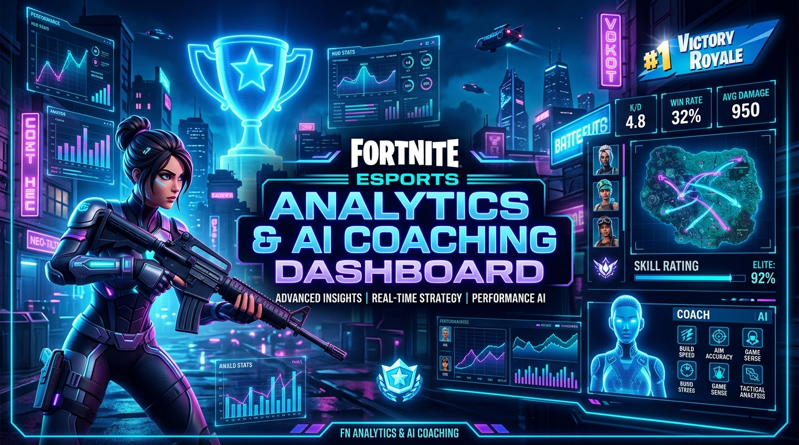
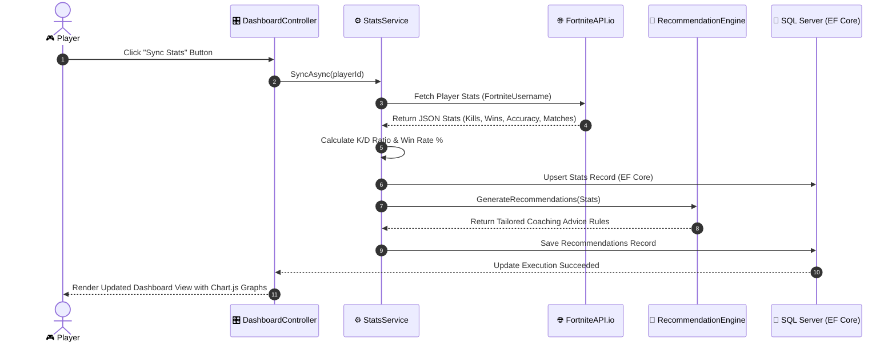
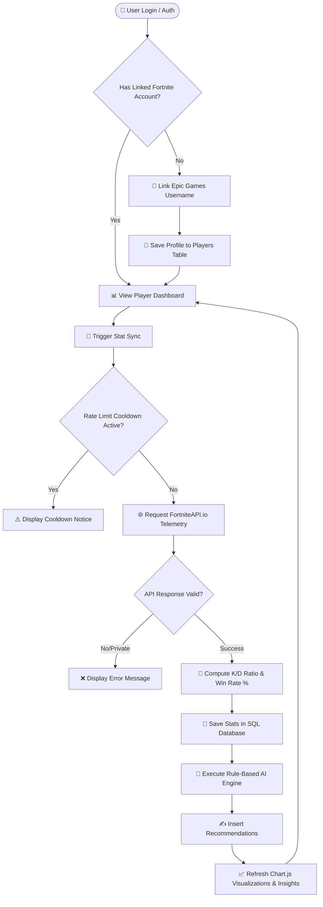
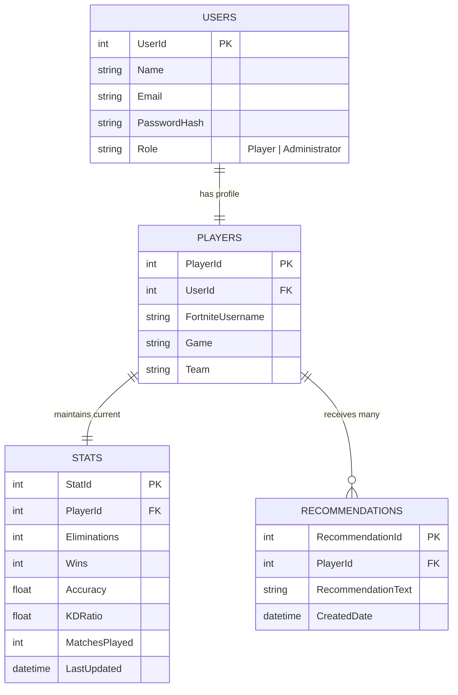

<div align="center">



# 🏆 Fortnite Performance Dashboard
### ASP.NET Core 8 MVC Esports Analytics & AI-Assisted Coaching System

[](https://dotnet.microsoft.com/)
[](https://learn.microsoft.com/en-us/dotnet/csharp/)
[](https://www.microsoft.com/en-us/sql-server/)
[](https://learn.microsoft.com/en-us/ef/core/)
[](https://getbootstrap.com/)
[](https://www.chartjs.org/)
[](https://fortniteapi.io/)

<p align="center">
  <b>A professional, enterprise-grade esports analytics web platform engineered with ASP.NET Core MVC. Pushing real-time player telemetries from FortniteAPI.io, computing automated esports KPIs, and delivering rule-based AI coaching recommendations to level up your Battle Royale gameplay.</b>
</p>

[Key Features](#-key-features) • [MVC Architecture](#-architecture--mvc-design-pattern) • [System Flowcharts](#-system-flowcharts--diagrams) • [Database Schema](#-database-schema--erd) • [AI Coaching Engine](#-ai-assisted-coaching-engine) • [Installation](#-installation--getting-started)

---

</div>

## 📌 Executive Summary & Case Study

In modern competitive Battle Royale esports like **Fortnite**, players generate immense volumes of performance metrics across every match—eliminations, survival placement, accuracy deltas, and K/D ratios. However, tracking performance historically across disjointed tools creates friction and obscures actionable improvement trends.

The **Fortnite Performance Dashboard** solves this by unifying player telemetries into a sleek, high-impact web application. By leveraging `FortniteAPI.io`, ASP.NET Core 8 MVC, Entity Framework Core, SQL Server, and Chart.js, the system automatically imports digital match metrics, calculates critical esports KPIs, renders interactive analytical charts, and executes rule-based AI coaching to pinpoint gameplay weaknesses.

---

## ✨ Key Features

- **🎮 Seamless Account Synchronization**: Link Epic Games / Fortnite usernames to pull real-time match data via `FortniteAPI.io`.
- **📊 Interactive Chart.js Dashboards**: High-performance visual breakdown of Elimination/Death (K/D) Ratios, Win Rates, Weapon Accuracy, and Match Volume trends over time.
- **🤖 Rule-Based AI Coaching Engine**: Automated evaluation engine providing custom actionable advice (aim training, bloom management, drop spot optimization, endgame survival).
- **🛡️ Thin Controller & Enterprise Service Layer**: Clean N-tier architecture separating HTTP routing, business logic, API clients, and database access.
- **👥 Role-Based Access Control (RBAC)**: Distinct workflows for **Players** (sync stats, view analytics, read coaching suggestions) and **Administrators** (manage player rosters, configure game mode categories like Solo/Duo/Squad, view platform-wide stats).
- **⚡ Cooldown & Rate-Limit Shield**: Smart client-side and server-side cooldown window enforcement keeping third-party API usage strictly within free-tier limits (10 requests/min).

---

## 🏗️ Architecture & MVC Design Pattern

The application enforces a strict **Layered (N-Tier) ASP.NET Core MVC Architecture**, isolating responsibilities so that controllers remain lightweight and business logic lives entirely within dedicated service interfaces.

```
       +-------------------------------------------------------------+
       |               PRESENTATION LAYER (Razor Views)              |
       |             HTML5 / Bootstrap 5 / Chart.js Data             |
       +------------------------------+------------------------------+
                                      |
                                      v
       +-------------------------------------------------------------+
       |                 CONTROLLER LAYER (Thin MVC)                 |
       |       DashboardController | AccountController | Admin       |
       +------------------------------+------------------------------+
                                      |
                                      v
       +-------------------------------------------------------------+
       |                   BUSINESS SERVICE LAYER                    |
       |  FortniteApiClient  |  StatsService  | RecommendationEngine  |
       +------------------------------+------------------------------+
                                      |
                                      v
       +-------------------------------------------------------------+
       |                  DATA ACCESS LAYER (EF Core)                |
       |               ApplicationDbContext / Entity Models          |
       +------------------------------+------------------------------+
                                      |
                                      v
       +-------------------------------------------------------------+
       |                     DATABASE ENGINE                         |
       |                   Microsoft SQL Server                      |
       +-------------------------------------------------------------+
```

### Applied Design Patterns Rationale

| Pattern | Implementation Location | Purpose & Architectural Benefit |
| :--- | :--- | :--- |
| **MVC Pattern** | Web Core (`Controllers/`, `Views/`, `Models/`) | Decouples request handling, data representation, and UI presentation. |
| **Service Layer** | `Services/` (`StatsService`, `FortniteApiClient`) | Encapsulates all third-party API interaction and mathematical stat calculations outside controllers. |
| **Strategy Pattern** | `Services/IRecommendationEngine.cs` | Decouples coaching rules into a swappable interface; allows seamless future replacement with LLM / OpenAI services without altering DB or controllers. |
| **Repository Semantics**| EF Core `DbContext` + `DbSet<T>` | Provides native unit-of-work state management and LINQ query abstraction. |
| **Dependency Injection**| ASP.NET Core Native DI (`Program.cs`) | Registers services with scoped/transient lifecycles to enable mock testing and loose coupling. |

---

## 📊 System Flowcharts & Diagrams

### 1. System Request & Execution Sequence



### 2. End-to-End System Workflow Flowchart



---

## 🖼️ AI Coaching & Analytics Interface


---

## 🗄️ Database Schema & ERD

The database architecture is designed with strict relational integrity in **Microsoft SQL Server**, ensuring low overhead and normalized entity relationships.



---

## 📈 Visual Performance KPI Mockups

Below is a representation of the analytical tracking generated on the presentation layer via **Chart.js**:

### 📊 Season Performance & Trend Metrics

```
+-----------------------------------------------------------------------+
|  K/D RATIO PROGRESSION (Last 5 Syncs)                                 |
|                                                                       |
|  4.0 |                                                     * (3.85)   |
|  3.5 |                                      * (3.40)                |
|  3.0 |                       * (2.95)                                 |
|  2.5 |        * (2.40)                                               |
|  2.0 | * (1.80)                                                       |
|      +------------------------------------------------------------    |
|        Sync #1       Sync #2       Sync #3     Sync #4     Sync #5    |
+-----------------------------------------------------------------------+
|  ACCURACY DELTA & WIN RATE DISTRIBUTION                               |
|  [████████████████████░░░░░░░░░] 68% Shot Accuracy (Assault/DMR)      |
|  [██████████████░░░░░░░░░░░░░░░] 48% Win Rate (Solo / Squads)         |
+-----------------------------------------------------------------------+
```

---

## 🤖 AI-Assisted Coaching Engine

The **RecommendationEngine** evaluates individual performance indicators against preset competitive thresholds to generate high-yield strategy tips:

```csharp
// Example Strategy Logic snippet (Services/RecommendationEngine.cs)
public class RuleBasedRecommendationEngine : IRecommendationEngine 
{
    public IEnumerable<string> GenerateRecommendations(Stats stat)
    {
        var recommendations = new List<string>();

        if (stat.Accuracy < 0.25f) {
            recommendations.Add("🎯 Low Accuracy Detected (<25%): Practice trigger discipline and bloom management in Creative Aim Trainers.");
        }
        if (stat.KDRatio < 1.5f) {
            recommendations.Add("⚔️ K/D Ratio Below Target (<1.5): Prioritize high-ground positioning during mid-game rotates.");
        }
        if (stat.Wins / (float)Math.Max(1, stat.MatchesPlayed) < 0.10f) {
            recommendations.Add("🏆 Win Rate Under 10%: Avoid unnecessary early 50/50 drops; target outer POIs for safer looting.");
        }
        return recommendations;
    }
}
```

> [!TIP]
> **Swappable Architecture**: Because the recommendation logic implements `IRecommendationEngine`, you can easily replace `RuleBasedRecommendationEngine` with `OpenAiCoachingEngine` via Dependency Injection in `Program.cs` without touching any Database or Controller logic!

---

## 📁 Repository Directory Structure

```
Fortnite-Performance-Dashboard/
├── assets/
│   └── images/                  # High-res graphics & architecture banners
│       ├── fortnite_dashboard_hero.jpg
│       └── fortnite_ai_coaching.jpg
├── Controllers/
│   ├── AccountController.cs     # Auth, Register, Login, Role claim management
│   ├── AdminController.cs       # Player roster management & platform stats
│   └── DashboardController.cs   # Main dashboard rendering & stat sync action
├── Data/
│   ├── ApplicationDbContext.cs  # EF Core DbContext configuration
│   └── Migrations/              # SQL Server Database migrations
├── Models/
│   ├── User.cs                  # User entity & credentials
│   ├── Player.cs                # Linked Fortnite profile model
│   ├── Stats.cs                 # Match stats & computed KPIs
│   └── Recommendation.cs       # AI recommendation entity
├── Services/
│   ├── IFortniteApiClient.cs    # Contract for external FortniteAPI.io client
│   ├── FortniteApiClient.cs     # API HTTP client implementation
│   ├── IStatsService.cs         # Stat processing contract
│   ├── StatsService.cs          # Core business logic & EF database updates
│   └── RecommendationEngine.cs  # Rule-based AI coaching strategy engine
├── Views/
│   ├── Dashboard/               # Dashboard Razor Views (Chart.js integration)
│   ├── Admin/                   # Admin panel views
│   └── Shared/                  # Layout, Navigation & Partial Views
├── wwwroot/
│   ├── css/                     # Custom dark-theme gaming stylesheet
│   └── js/                      # Chart.js initialization scripts
├── appsettings.json             # API Keys & Connection Strings
├── Program.cs                   # ASP.NET Core DI setup & middleware pipeline
└── README.md                    # Project documentation
```

---

## ⚙️ Installation & Getting Started

### Prerequisites

- [NET 8.0 SDK](https://dotnet.microsoft.com/download/dotnet/8.0) installed
- [Microsoft SQL Server](https://www.microsoft.com/en-us/sql-server/sql-server-downloads) (LocalDB, Express, or Enterprise)
- Visual Studio 2022 / VS Code / JetBrains Rider
- Free API Key from [FortniteAPI.io](https://fortniteapi.io/)

### 🚀 Setup Steps

1. **Clone the Repository**:
   ```bash
   git clone https://github.com/RaunakSachdeva2004/Fortnite-Performance-Dashboard.git
   cd Fortnite-Performance-Dashboard
   ```

2. **Configure Settings**:
   Open `appsettings.json` and add your Database Connection String and FortniteAPI.io key:
   ```json
   {
     "ConnectionStrings": {
       "DefaultConnection": "Server=(localdb)\\mssqllocaldb;Database=FortniteDashboardDb;Trusted_Connection=True;MultipleActiveResultSets=true"
     },
     "FortniteApi": {
       "ApiKey": "YOUR_FORTNITE_API_KEY_HERE",
       "BaseUrl": "https://fortniteapi.io/v1/"
     }
   }
   ```

3. **Apply EF Core Database Migrations**:
   ```bash
   dotnet ef database update
   ```

4. **Build & Run the Application**:
   ```bash
   dotnet run
   ```

5. **Access the Dashboard**:
   Open your browser and navigate to `https://localhost:7050` or `http://localhost:5050`.

---

## 🛡️ Non-Functional Requirements & Security

- **🔒 Password Security**: Uses ASP.NET Core Identity password hashing (`PasswordHasher<T>`).
- **🛡️ SQL Injection Prevention**: EF Core parametrizes all query operations by default via LINQ.
- **🛑 Rate-Limiting**: Cooldown mechanism client/server side respecting `FortniteAPI.io` rate limit (10 calls/min on free tier).
- **🔑 Role-Based Access Control**: Sensitive actions are decorated with `[Authorize(Roles = "Administrator")]` attributes.
- **⚡ High Responsiveness**: Client-side chart rendering via pre-fetched JSON payloads avoids server rendering bottlenecks.

---

## 🔮 Future Roadmap (Out-of-Scope Extensions)

- [ ] **Live Telemetry Stream**: Real-time match tracking during live gameplay.
- [ ] **LLM Integration**: Replacing the rule-based recommendation strategy with OpenAI GPT-4 / Gemini API for personalized video breakdown tips.
- [ ] **Weapon Loadout Analytics**: Granular weapon choice effectiveness tracking (Shotgun vs SMG win rates).
- [ ] **Esports Team Tournaments**: Squad ranking leaderboards for amateur esports organizations.

---

<div align="center">

Developed with ❤️ by **Group 15** for ASP.NET Core MVC Capstone / System Design.

[](https://github.com/RaunakSachdeva2004/Fortnite-Performance-Dashboard)

</div>
