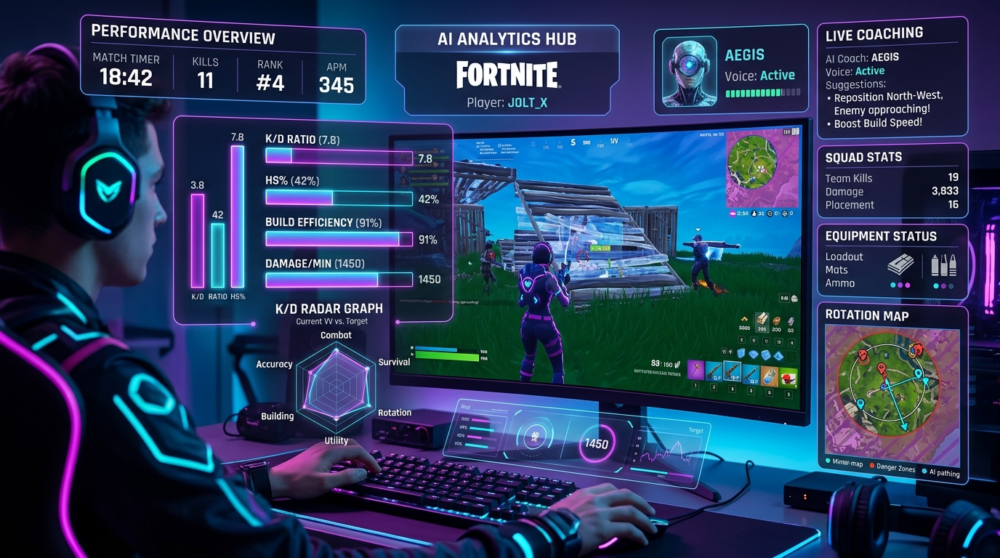
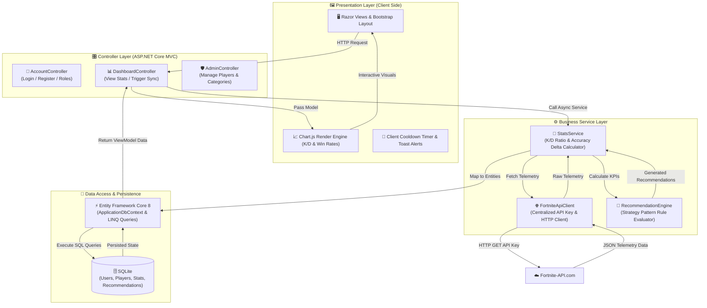
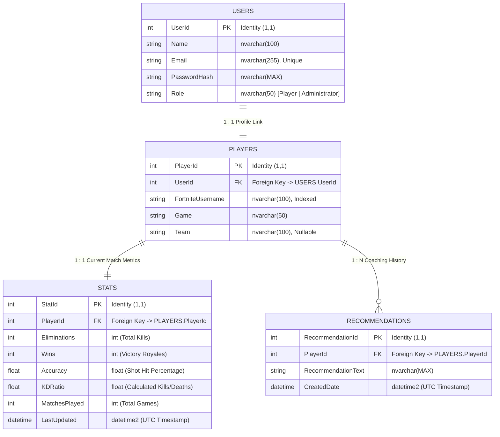
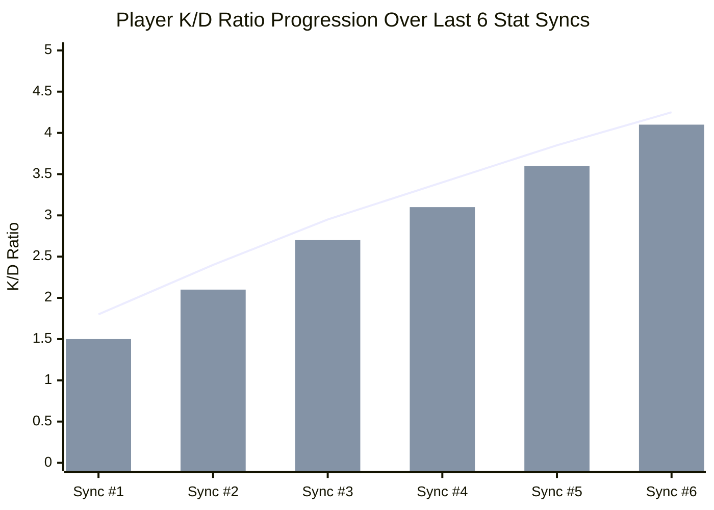
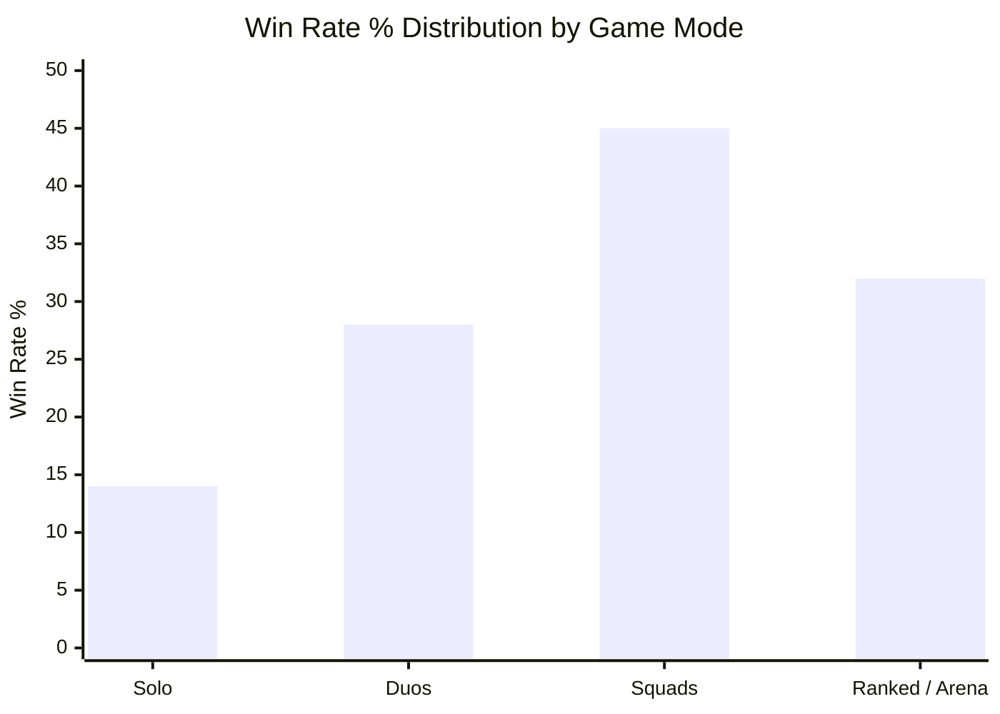

<div align="center">



# 🏆 Fortnite Performance Dashboard
### ASP.NET Core 8 MVC Esports Analytics & AI-Assisted Coaching System

[](https://dotnet.microsoft.com/)
[](https://learn.microsoft.com/en-us/dotnet/csharp/)
[](https://www.sqlite.org/)
[](https://learn.microsoft.com/en-us/ef/core/)
[](https://getbootstrap.com/)
[](https://www.chartjs.org/)
[](https://fortnite-api.com/)

<p align="center">
  <b>An esports analytics web platform engineered with ASP.NET Core MVC. Syncs player match stats via Fortnite-API.com, computes esports KPIs, renders Chart.js trends, and generates rule-based AI coaching recommendations.</b>
</p>

[Key Features](#-key-features) • [MVC Architecture](#-architecture--mvc-design-pattern) • [Flowcharts & Diagrams](#-system-flowcharts--diagrams) • [Database Schema](#-database-schema--erd) • [Performance Charts](#-performance-analytics--charts) • [AI Coaching Engine](#-ai-assisted-coaching-engine) • [Installation](#-installation--getting-started)

---

</div>

## 📌 Case Study & Overview

In competitive Battle Royale games like **Fortnite**, players generate rich match telemetries—eliminations, survival placement, weapon accuracy, and K/D ratios. However, checking stats across scattered tools obscures historical improvement trends.

The **Fortnite Performance Dashboard** unifies player match data into a clean ASP.NET Core 8 MVC web application. Integrating `Fortnite-API.com`, Entity Framework Core, SQLite, and Chart.js, the system imports digital match metrics, computes performance KPIs, renders dynamic trend graphs, and executes a rule-based AI coaching engine to highlight actionable areas for improvement.

---

## ✨ Key Features

- **🎮 Fortnite Account Sync**: Link Epic Games usernames to fetch real-time match statistics from `Fortnite-API.com`.
- **📊 Chart.js Analytics**: Visual breakdowns of K/D Ratios, Win Rates, Weapon Accuracy, and Match Volume trends.
- **🤖 Rule-Based AI Coaching**: Automated advice generator evaluating player metrics against competitive thresholds.
- **🛡️ Clean MVC & Service Layer**: Decoupled N-tier architecture keeping controllers lightweight and business logic encapsulated.
- **👥 Role-Based Access Control (RBAC)**: Distinct permissions for **Players** (sync & view stats/coaching) and **Administrators** (manage roster & game mode categories).
- **⚡ Rate-Limit Protection**: Built-in cooldown handling for `Fortnite-API.com` free-tier rate limits (10 requests/min, conservative default).

---

## 🏗️ Architecture & MVC Design Pattern

The application enforces a **Layered (N-Tier) ASP.NET Core MVC Architecture**, ensuring clear separation of concerns:

```
       +-------------------------------------------------------------+
       |               PRESENTATION LAYER (Razor Views)              |
       |             HTML5 / Bootstrap 5 / Chart.js Data             |
       +------------------------------+------------------------------+
                                      |
                                      v
       +-------------------------------------------------------------+
       |                 CONTROLLER LAYER (Thin MVC)                 |
       |       DashboardController | AccountController | Admin       |
       +------------------------------+------------------------------+
                                      |
                                      v
       +-------------------------------------------------------------+
       |                   BUSINESS SERVICE LAYER                    |
       |  FortniteApiClient  |  StatsService  | RecommendationEngine  |
       +------------------------------+------------------------------+
                                      |
                                      v
       +-------------------------------------------------------------+
       |                  DATA ACCESS LAYER (EF Core)                |
       |               ApplicationDbContext / Entity Models          |
       +------------------------------+------------------------------+
                                      |
                                      v
       +-------------------------------------------------------------+
       |                     DATABASE ENGINE                         |
       |                        SQLite                                |
       +-------------------------------------------------------------+
```

### Applied Design Patterns

| Pattern | Location | Architectural Purpose |
| :--- | :--- | :--- |
| **MVC Pattern** | Web Core | Decouples HTTP request routing, data representation, and UI views. |
| **Service Layer** | `Services/` | Encapsulates third-party API calls and KPI computations outside controllers. |
| **Strategy Pattern** | `IRecommendationEngine.cs` | Allows swapping rule-based coaching for AI/LLM models without modifying DB/Controllers. |
| **Repository Semantics**| EF Core `DbContext` | Native unit-of-work state tracking and LINQ abstractions. |
| **Dependency Injection**| ASP.NET Core Native DI | Registers services with scoped lifecycles for testability and loose coupling. |

---

## 📊 System Flowcharts & Diagrams

### 1. High-Precision Request & Execution Sequence

```mermaid
sequenceDiagram
    autonumber
    actor Player as 🎮 Player (Browser)
    participant View as 🖼️ Razor / Chart.js UI
    participant Ctrl as 🎛️ DashboardController
    participant Service as ⚙️ StatsService
    participant API as 🌐 Fortnite-API.com Client
    participant Engine as 🧠 RecommendationEngine
    participant DB as 💾 SQLite (EF Core)

    Player->>View: Clicks "Sync Stats" Button
    View->>Ctrl: POST /Dashboard/SyncStats (PlayerId)
    Ctrl->>Service: SyncPlayerStatsAsync(playerId)
    
    rect rgb(25, 30, 45)
        Note over Service, API: External API Ingestion & Rate Limit Handling
        Service->>API: GetPlayerStatsAsync(FortniteUsername)
        alt Cooldown Active or Rate Limited (10 req/min)
            API-->>Service: HTTP 429 RateLimitExceeded Exception
            Service-->>Ctrl: Return CooldownWarningResult
            Ctrl-->>View: Render Toast Warning ("Wait 60s before re-syncing")
        else Successful Telemetry Fetch
            API-->>Service: Return JSON Telemetry (Kills, Wins, Matches, Accuracy)
        end
    end

    rect rgb(30, 45, 30)
        Note over Service, DB: KPI Computation & Persistence
        Service->>Service: Compute K/D Ratio (Kills / Deaths) & Win Rate %
        Service->>DB: ApplicationDbContext.Stats.Upsert(StatsEntity)
        DB-->>Service: Confirm StatId & Transaction Commit
    end

    rect rgb(45, 30, 45)
        Note over Service, Engine: AI Coaching Rule Engine Execution
        Service->>Engine: GenerateRecommendations(StatsEntity)
        Engine->>Engine: Evaluate Thresholds (Accuracy < 25%, K/D < 1.5, Win% < 10%)
        Engine-->>Service: Return List<RecommendationText>
        Service->>DB: SaveChangesAsync(RecommendationsList)
        DB-->>Service: Insert Confirmed
    end

    Service-->>Ctrl: Return DashboardViewModel (Updated Stats + Tips)
    Ctrl-->>View: Render Razor View + Chart.js Dataset
    View-->>Player: Display Updated Graphs & Coaching Tips
```



---

### 2. End-to-End Modular System Architecture Flowchart



---

## 🗄️ Database Schema & ERD

The database schema is fully normalized and implemented in **SQLite** with Entity Framework Core annotations and foreign key constraints:



---

## 📈 Performance Analytics & Charts

The dashboard generates real-time telemetry visual breakdowns using **Chart.js** on the frontend. Below are the structured KPI metrics rendered for each player session:

### 1. K/D Ratio & Accuracy Growth Trend (Historical Match Syncs)



### 2. Game Mode Performance Breakdown (Win Rate %)



---

## 🤖 AI-Assisted Coaching Engine

The **RecommendationEngine** evaluates match performance against competitive thresholds:

```csharp
public class RuleBasedRecommendationEngine : IRecommendationEngine 
{
    public IEnumerable<string> GenerateRecommendations(Stats stat)
    {
        var recommendations = new List<string>();

        if (stat.Accuracy < 0.25f) {
            recommendations.Add("🎯 Low Accuracy (<25%): Focus on bloom control and trigger discipline.");
        }
        if (stat.KDRatio < 1.5f) {
            recommendations.Add("⚔️ Low K/D (<1.5): Work on high-ground retakes during mid-game rotations.");
        }
        if (stat.Wins / (float)Math.Max(1, stat.MatchesPlayed) < 0.10f) {
            recommendations.Add("🏆 Win Rate < 10%: Avoid hot dropping; prioritize edge POIs for safer looting.");
        }
        return recommendations;
    }
}
```

---

## 📁 Repository Structure

```
Fortnite-Performance-Dashboard/
├── assets/
│   └── images/                  # Graphic asset for README header
│       └── fortnite_ai_coaching.jpg
├── Controllers/
│   ├── AccountController.cs     # Auth, Registration, Roles
│   ├── AdminController.cs       # Roster management & admin stats
│   └── DashboardController.cs   # Dashboard rendering & sync trigger
├── Data/
│   ├── ApplicationDbContext.cs  # EF Core DbContext
│   └── Migrations/              # Database migration scripts
├── Models/
│   ├── User.cs                  # User entity & credentials
│   ├── Player.cs                # Linked Fortnite profile model
│   ├── Stats.cs                 # Match stats & computed KPIs
│   └── Recommendation.cs       # AI recommendation entity
├── Services/
│   ├── IFortniteApiClient.cs    # Fortnite-API.com client interface
│   ├── FortniteApiClient.cs     # API client implementation
│   ├── IStatsService.cs         # Stat processing interface
│   ├── StatsService.cs          # Core business logic & database updates
│   └── RuleBasedRecommendationEngine.cs  # Rule-based AI coaching engine
├── Views/
│   ├── Dashboard/               # Razor Views with Chart.js
│   ├── Admin/                   # Admin panel views
│   └── Shared/                  # Navigation & layout templates
├── appsettings.json             # Non-secret config & SQLite connection string
├── Program.cs                   # Middleware & Dependency Injection setup
└── README.md                    # Project documentation
```

---

## ⚙️ Quick Start

**Option A — Visual Studio**

1. Clone the repo and open `FortniteDashboard.slnx` (or `FortniteDashboard.sln`).
2. Right-click the project → **Manage User Secrets**, and add:
   ```json
   {
     "FortniteApi:ApiKey": "your-real-fortnite-api.com-key",
     "SeedAdmin:Password": "choose-your-own-admin-password"
   }
   ```
3. Open **Tools → NuGet Package Manager → Package Manager Console** and run:
   ```
   Add-Migration InitialCreate
   Update-Database
   ```
4. Press **F5**. On first run in Development, the app also auto-applies any
   pending migrations and seeds one Administrator account (see console output
   for the seeded email — password is whatever you set above).

**Option B — command line**

```bash
git clone https://github.com/RaunakSachdeva2004/Fortnite-Performance-Dashboard.git
cd Fortnite-Performance-Dashboard

dotnet user-secrets init
dotnet user-secrets set "FortniteApi:ApiKey" "your-real-fortnite-api.com-key"
dotnet user-secrets set "SeedAdmin:Password" "choose-your-own-admin-password"

dotnet ef migrations add InitialCreate
dotnet ef database update

dotnet run
```

No SQL Server/LocalDB install is required — `fortnite_dashboard.db` is created
automatically as a plain file in the project folder. See
`Docs/SQLite_Migration_Notes.md` for details on what changed and why.

---

<div align="center">

Developed with ❤️ by **Group 15** for ASP.NET Core MVC Capstone.

</div>
