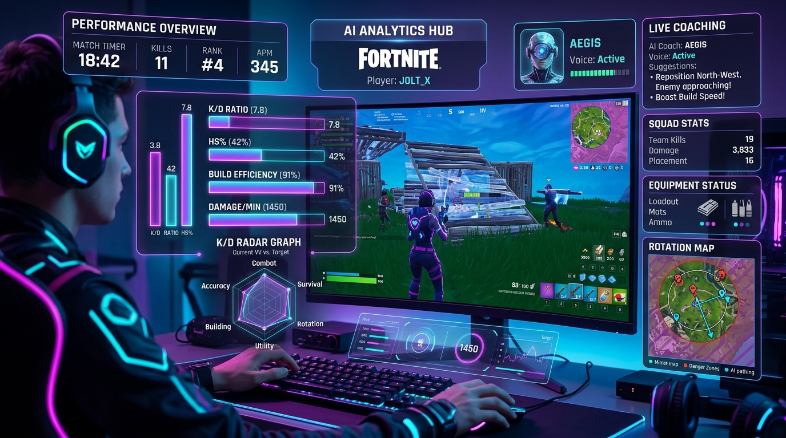
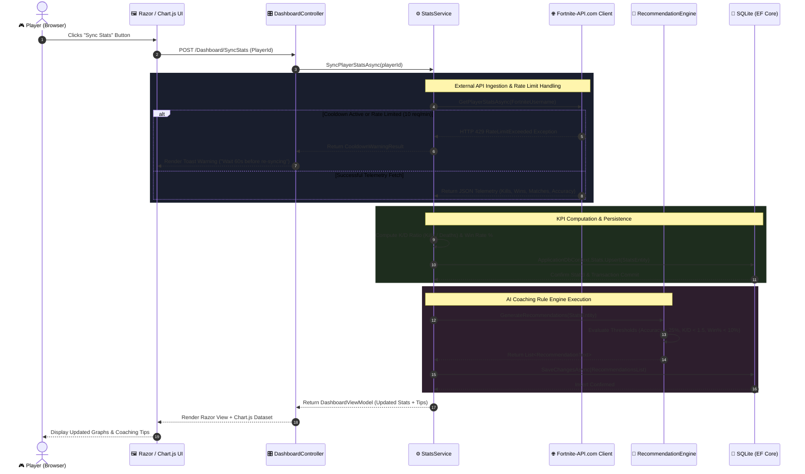
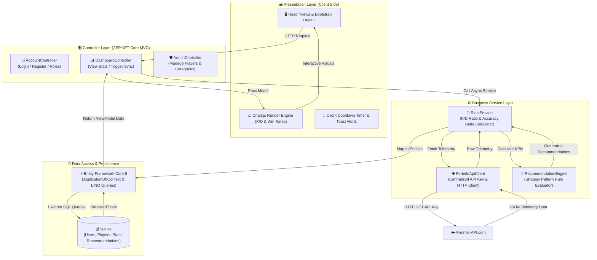
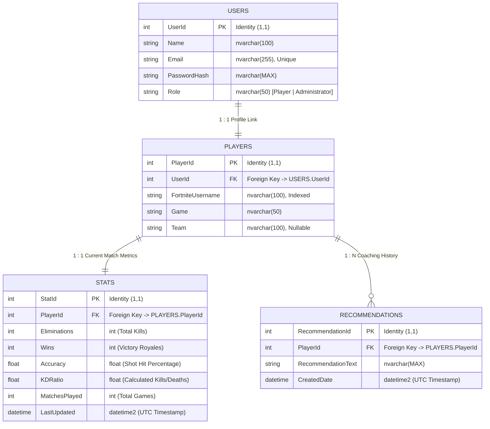
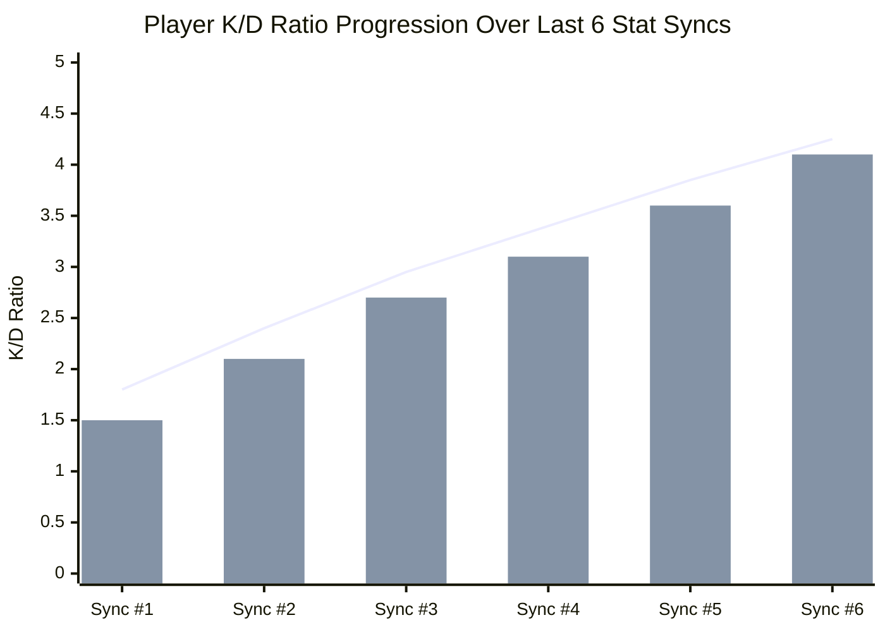
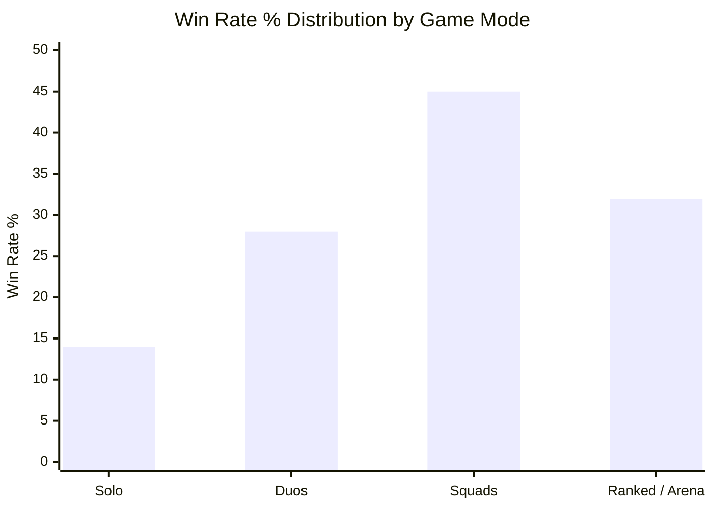

<div align="center">



# 🏆 Fortnite Performance Dashboard
### ASP.NET Core 8 MVC Esports Analytics & AI-Assisted Coaching System

[](https://dotnet.microsoft.com/)
[](https://learn.microsoft.com/en-us/dotnet/csharp/)
[](https://www.sqlite.org/)
[](https://learn.microsoft.com/en-us/ef/core/)
[](https://getbootstrap.com/)
[](https://www.chartjs.org/)
[](https://fortnite-api.com/)

<p align="center">
  <b>An esports analytics web platform engineered with ASP.NET Core MVC. Syncs player match stats via Fortnite-API.com, computes esports KPIs, renders Chart.js trends, and generates rule-based AI coaching recommendations.</b>
</p>

[Key Features](#-key-features) • [MVC Architecture](#-architecture--mvc-design-pattern) • [Flowcharts & Diagrams](#-system-flowcharts--diagrams) • [Database Schema](#-database-schema--erd) • [Performance Charts](#-performance-analytics--charts) • [AI Coaching Engine](#-ai-assisted-coaching-engine) • [Installation](#-installation--getting-started)

---

</div>

## 📌 Case Study & Overview

In competitive Battle Royale games like **Fortnite**, players generate rich match telemetries—eliminations, survival placement, weapon accuracy, and K/D ratios. However, checking stats across scattered tools obscures historical improvement trends.

The **Fortnite Performance Dashboard** unifies player match data into a clean ASP.NET Core 8 MVC web application. Integrating `Fortnite-API.com`, Entity Framework Core, SQLite, and Chart.js, the system imports digital match metrics, computes performance KPIs, renders dynamic trend graphs, and executes a rule-based AI coaching engine to highlight actionable areas for improvement.

---

## ✨ Key Features

- **🎮 Fortnite Account Sync**: Link Epic Games usernames to fetch real-time match statistics from `Fortnite-API.com`.
- **📊 Chart.js Analytics**: Visual breakdowns of K/D Ratios, Win Rates, Weapon Accuracy, and Match Volume trends.
- **🤖 Rule-Based AI Coaching**: Automated advice generator evaluating player metrics against competitive thresholds.
- **🛡️ Clean MVC & Service Layer**: Decoupled N-tier architecture keeping controllers lightweight and business logic encapsulated.
- **👥 Role-Based Access Control (RBAC)**: Distinct permissions for **Players** (sync & view stats/coaching) and **Administrators** (manage roster & game mode categories).
- **⚡ Rate-Limit Protection**: Built-in cooldown handling for `Fortnite-API.com` free-tier rate limits (10 requests/min, conservative default).

---

## 🏗️ Architecture & MVC Design Pattern

The application enforces a **Layered (N-Tier) ASP.NET Core MVC Architecture**, ensuring clear separation of concerns:

```
       +-------------------------------------------------------------+
       |               PRESENTATION LAYER (Razor Views)              |
       |             HTML5 / Bootstrap 5 / Chart.js Data             |
       +------------------------------+------------------------------+
                                      |
                                      v
       +-------------------------------------------------------------+
       |                 CONTROLLER LAYER (Thin MVC)                 |
       |       DashboardController | AccountController | Admin       |
       +------------------------------+------------------------------+
                                      |
                                      v
       +-------------------------------------------------------------+
       |                   BUSINESS SERVICE LAYER                    |
       |  FortniteApiClient  |  StatsService  | RecommendationEngine  |
       +------------------------------+------------------------------+
                                      |
                                      v
       +-------------------------------------------------------------+
       |                  DATA ACCESS LAYER (EF Core)                |
       |               ApplicationDbContext / Entity Models          |
       +------------------------------+------------------------------+
                                      |
                                      v
       +-------------------------------------------------------------+
       |                     DATABASE ENGINE                         |
       |                        SQLite                                |
       +-------------------------------------------------------------+
```

### Applied Design Patterns

| Pattern | Location | Architectural Purpose |
| :--- | :--- | :--- |
| **MVC Pattern** | Web Core | Decouples HTTP request routing, data representation, and UI views. |
| **Service Layer** | `Services/` | Encapsulates third-party API calls and KPI computations outside controllers. |
| **Strategy Pattern** | `IRecommendationEngine.cs` | Allows swapping rule-based coaching for AI/LLM models without modifying DB/Controllers. |
| **Repository Semantics**| EF Core `DbContext` | Native unit-of-work state tracking and LINQ abstractions. |
| **Dependency Injection**| ASP.NET Core Native DI | Registers services with scoped lifecycles for testability and loose coupling. |

---

## 📊 System Flowcharts & Diagrams

### 1. High-Precision Request & Execution Sequence


```mermaid
sequenceDiagram
    autonumber
    actor Player as 🎮 Player (Browser)
    participant View as 🖼️ Razor / Chart.js UI
    participant Ctrl as 🎛️ DashboardController
    participant Service as ⚙️ StatsService
    participant API as 🌐 Fortnite-API.com Client
    participant Engine as 🧠 RecommendationEngine
    participant DB as 💾 SQLite (EF Core)

    Player->>View: Clicks "Sync Stats" Button
    View->>Ctrl: POST /Dashboard/SyncStats (PlayerId)
    Ctrl->>Service: SyncPlayerStatsAsync(playerId)
    
    rect rgb(25, 30, 45)
        Note over Service, API: External API Ingestion & Rate Limit Handling
        Service->>API: GetPlayerStatsAsync(FortniteUsername)
        alt Cooldown Active or Rate Limited (10 req/min)
            API-->>Service: HTTP 429 RateLimitExceeded Exception
            Service-->>Ctrl: Return CooldownWarningResult
            Ctrl-->>View: Render Toast Warning ("Wait 60s before re-syncing")
        else Successful Telemetry Fetch
            API-->>Service: Return JSON Telemetry (Kills, Wins, Matches, Accuracy)
        end
    end

    rect rgb(30, 45, 30)
        Note over Service, DB: KPI Computation & Persistence
        Service->>Service: Compute K/D Ratio (Kills / Deaths) & Win Rate %
        Service->>DB: ApplicationDbContext.Stats.Upsert(StatsEntity)
        DB-->>Service: Confirm StatId & Transaction Commit
    end

    rect rgb(45, 30, 45)
        Note over Service, Engine: AI Coaching Rule Engine Execution
        Service->>Engine: GenerateRecommendations(StatsEntity)
        Engine->>Engine: Evaluate Thresholds (Accuracy < 25%, K/D < 1.5, Win% < 10%)
        Engine-->>Service: Return List<RecommendationText>
        Service->>DB: SaveChangesAsync(RecommendationsList)
        DB-->>Service: Insert Confirmed
    end

    Service-->>Ctrl: Return DashboardViewModel (Updated Stats + Tips)
    Ctrl-->>View: Render Razor View + Chart.js Dataset
    View-->>Player: Display Updated Graphs & Coaching Tips
```

---

### 2. End-to-End Modular System Architecture Flowchart


```mermaid
flowchart TB
    subgraph PRESENTATION["🖼️ Presentation Layer (Client Side)"]
        UI["🖥️ Razor Views & Bootstrap Layout"]
        CHART["📈 Chart.js Render Engine (K/D & Win Rates)"]
        NOTIF["🔔 Client Cooldown Timer & Toast Alerts"]
    end

    subgraph CONTROLLER["🎛️ Controller Layer (ASP.NET Core MVC)"]
        AUTH_CTRL["🔐 AccountController\n(Login / Register / Roles)"]
        DASH_CTRL["📊 DashboardController\n(View Stats / Trigger Sync)"]
        ADMIN_CTRL["🛡️ AdminController\n(Manage Players & Categories)"]
    end

    subgraph SERVICES["⚙️ Business Service Layer"]
        API_CLIENT["🌐 FortniteApiClient\n(Centralized API Key & HTTP Client)"]
        STATS_SVC["📐 StatsService\n(K/D Ratio & Accuracy Delta Calculator)"]
        COACH_ENG["🧠 RecommendationEngine\n(Strategy Pattern Rule Evaluator)"]
    end

    subgraph DATA["💾 Data Access & Persistence"]
        EF_CORE["⚡ Entity Framework Core 8\n(ApplicationDbContext & LINQ Queries)"]
        SQL_DB[("🗄️ SQLite\n(Users, Players, Stats, Recommendations)")]
    end

    %% User Interaction Flow
    UI -->|HTTP Request| DASH_CTRL
    DASH_CTRL -->|Call Async Service| STATS_SVC
    STATS_SVC -->|Fetch Telemetry| API_CLIENT
    API_CLIENT -->|HTTP GET API Key| EXT_API["☁️ Fortnite-API.com"]
    EXT_API -->|JSON Telemetry Data| API_CLIENT
    API_CLIENT -->|Raw Telemetry| STATS_SVC
    STATS_SVC -->|Calculate KPIs| COACH_ENG
    COACH_ENG -->|Generated Recommendations| STATS_SVC
    STATS_SVC -->|Map to Entities| EF_CORE
    EF_CORE -->|Execute SQL Queries| SQL_DB
    SQL_DB -->|Persisted State| EF_CORE
    EF_CORE -->|Return ViewModel Data| DASH_CTRL
    DASH_CTRL -->|Pass Model| CHART
    CHART -->|Interactive Visuals| UI
```

---

## 🗄️ Database Schema & ERD

The database schema is fully normalized and implemented in **SQLite** with Entity Framework Core annotations and foreign key constraints:


```mermaid
erDiagram
    USERS ||--|| PLAYERS : "1 : 1 Profile Link"
    PLAYERS ||--|| STATS : "1 : 1 Current Match Metrics"
    PLAYERS ||--o{ RECOMMENDATIONS : "1 : N Coaching History"

    USERS {
        int UserId PK "Identity (1,1)"
        string Name "nvarchar(100)"
        string Email "nvarchar(255), Unique"
        string PasswordHash "nvarchar(MAX)"
        string Role "nvarchar(50) [Player | Administrator]"
    }

    PLAYERS {
        int PlayerId PK "Identity (1,1)"
        int UserId FK "Foreign Key -> USERS.UserId"
        string FortniteUsername "nvarchar(100), Indexed"
        string Game "nvarchar(50)"
        string Team "nvarchar(100), Nullable"
    }

    STATS {
        int StatId PK "Identity (1,1)"
        int PlayerId FK "Foreign Key -> PLAYERS.PlayerId"
        int Eliminations "int (Total Kills)"
        int Wins "int (Victory Royales)"
        float Accuracy "float (Shot Hit Percentage)"
        float KDRatio "float (Calculated Kills/Deaths)"
        int MatchesPlayed "int (Total Games)"
        datetime LastUpdated "datetime2 (UTC Timestamp)"
    }

    RECOMMENDATIONS {
        int RecommendationId PK "Identity (1,1)"
        int PlayerId FK "Foreign Key -> PLAYERS.PlayerId"
        string RecommendationText "nvarchar(MAX)"
        datetime CreatedDate "datetime2 (UTC Timestamp)"
    }
```

---

## 📈 Performance Analytics & Charts

The dashboard generates real-time telemetry visual breakdowns using **Chart.js** on the frontend. Below are the structured KPI metrics rendered for each player session:

### 1. K/D Ratio & Accuracy Growth Trend (Historical Match Syncs)


```mermaid
xychart-beta
    title "Player K/D Ratio Progression Over Last 6 Stat Syncs"
    x-axis ["Sync #1", "Sync #2", "Sync #3", "Sync #4", "Sync #5", "Sync #6"]
    y-axis "K/D Ratio" 0.0 --> 5.0
    line [1.80, 2.40, 2.95, 3.40, 3.85, 4.25]
    bar [1.50, 2.10, 2.70, 3.10, 3.60, 4.10]
```

### 2. Game Mode Performance Breakdown (Win Rate %)


```mermaid
xychart-beta
    title "Win Rate % Distribution by Game Mode"
    x-axis ["Solo", "Duos", "Squads", "Ranked / Arena"]
    y-axis "Win Rate %" 0 --> 50
    bar [14, 28, 45, 32]
```

---

## 🤖 AI-Assisted Coaching Engine

The **RecommendationEngine** evaluates match performance against competitive thresholds:

```csharp
public class RuleBasedRecommendationEngine : IRecommendationEngine 
{
    public IEnumerable<string> GenerateRecommendations(Stats stat)
    {
        var recommendations = new List<string>();

        if (stat.Accuracy < 0.25f) {
            recommendations.Add("🎯 Low Accuracy (<25%): Focus on bloom control and trigger discipline.");
        }
        if (stat.KDRatio < 1.5f) {
            recommendations.Add("⚔️ Low K/D (<1.5): Work on high-ground retakes during mid-game rotations.");
        }
        if (stat.Wins / (float)Math.Max(1, stat.MatchesPlayed) < 0.10f) {
            recommendations.Add("🏆 Win Rate < 10%: Avoid hot dropping; prioritize edge POIs for safer looting.");
        }
        return recommendations;
    }
}
```

---

## 📁 Repository Structure

```
Fortnite-Performance-Dashboard/
├── assets/
│   └── images/                       # Graphic assets for documentation & hero banners
│       ├── fortnite_ai_coaching.jpg
│       └── fortnite_dashboard_hero.jpg
├── Controllers/
│   ├── AccountController.cs          # Authentication, Registration & Cookie Sign-In
│   ├── AdminController.cs            # Admin player roster management & stats overview
│   ├── DashboardController.cs        # Player dashboard rendering & Fortnite-API sync
│   └── ErrorController.cs            # Global error routing & friendly error pages
├── Data/
│   └── ApplicationDbContext.cs       # EF Core DbContext & entity configurations
├── Migrations/                       # EF Core SQLite database migration scripts
├── Models/
│   ├── FortniteApiModels.cs          # Fortnite-API.com response DTOs
│   └── Models.cs                     # Domain entities (User, Player, Stats, Recommendation)
├── viewmodels/
│   ├── AdminViewModels.cs            # Admin panel view models & forms
│   ├── AuthViewModels.cs             # Login and Registration view models
│   └── DashboardViewModel.cs         # Dashboard KPI & chart payload view models
├── Services/
│   ├── IFortniteApiClient.cs         # Fortnite API client interface
│   ├── FortniteApiClient.cs          # HTTP client for Fortnite-API.com
│   ├── IStatsService.cs              # Stats sync & aggregation interface
│   ├── StatsService.cs               # Player telemetry & database persistence service
│   ├── StatsCalculator.cs            # KPI computation (K/D, Win Rate, Accuracy)
│   ├── IRecommendationEngine.cs      # Recommendation engine contract
│   └── RuleBasedRecommendationEngine.cs # AI-assisted coaching rule evaluator
├── Views/
│   ├── Account/                      # Login, Registration, and Access Denied views
│   ├── Admin/                        # Admin dashboard & player management views
│   ├── Dashboard/                    # Main player dashboard & Chart.js views
│   ├── Error/                        # Error response views
│   └── Shared/                       # Layout (_Layout.cshtml) & navigation navbar
├── wwwroot/
│   ├── css/styles.css                # Custom dark/neon esports styling
│   └── js/dashboard-charts.js        # Chart.js rendering & telemetry graph logic
├── FortniteDashboard.Tests/          # Automated xUnit test suite
│   ├── RuleBasedRecommendationEngineTests.cs
│   └── StatsCalculatorTests.cs
├── Docs/                             # Requirement Analysis & System Architecture PDFs
├── Database/                         # SQLite & SQL Server DDL reference schemas
├── appsettings.json                  # Application configuration & connection strings
├── Program.cs                        # Middleware pipeline & Dependency Injection
├── FortniteDashboard.csproj          # ASP.NET Core project definition
└── README.md                         # Project documentation & guides
```

---

## ⚙️ Quick Start

### 🚀 Option A — Visual Studio (Recommended)

1. Clone the repository and open **`FortniteDashboard.slnx`** (or `FortniteDashboard.sln`).
2. *(Optional)* Right-click **FortniteDashboard** project → **Manage User Secrets** to configure custom credentials:
   ```json
   {
     "FortniteApi:ApiKey": "your-optional-fortnite-api-key",
     "SeedAdmin:Password": "YourCustomAdminPassword123!"
   }
   ```
3. Press **F5** (or click **Start Debugging**).
   - EF Core automatically applies SQLite migrations and seeds the Administrator account upon launch.
   - The app opens at `http://localhost:5001` or `https://localhost:5002`.

---

### 💻 Option B — .NET CLI

```bash
# 1. Clone the repository
git clone https://github.com/RaunakSachdeva2004/Fortnite-Performance-Dashboard.git
cd Fortnite-Performance-Dashboard

# 2. (Optional) Set user secrets — if omitted, default fallback password 'ChangeMe123!' is used
dotnet user-secrets set "FortniteApi:ApiKey" "your-optional-fortnite-api-key" --project FortniteDashboard.csproj
dotnet user-secrets set "SeedAdmin:Password" "YourCustomAdminPassword123!" --project FortniteDashboard.csproj

# 3. Run the application (SQLite database auto-migrates and seeds on boot)
dotnet run --project FortniteDashboard.csproj
```

Open your browser and navigate to **`http://localhost:5001`**.

---

### 🔑 Default Development Credentials

| Role | Email | Password |
|---|---|---|
| **Administrator** | `admin@fortnitedashboard.local` | `ChangeMe123!` *(or custom User Secret password)* |

> [!NOTE]
> No SQL Server or LocalDB installation is required. A local SQLite database (`fortnite_dashboard.db`) is automatically created and migrated in the project root directory. See [`Docs/SQLite_Migration_Notes.md`](./Docs/SQLite_Migration_Notes.md) for architecture details.

---

<div align="center">

Developed with ❤️ by **Group 15** for ASP.NET Core MVC Capstone.

</div>
